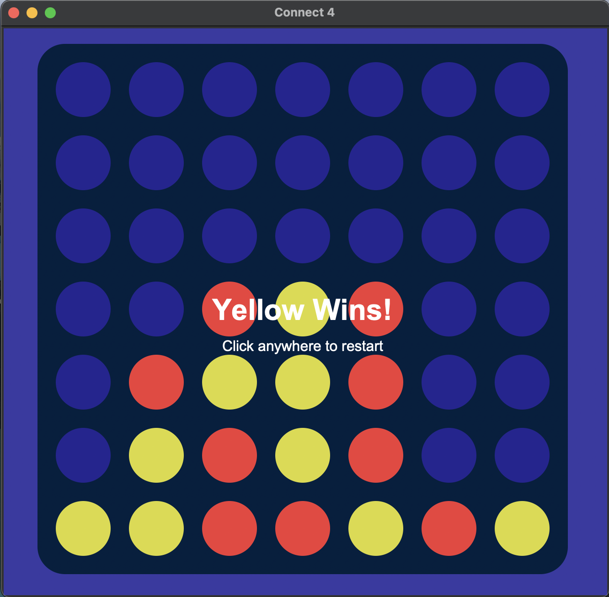

# Connect 4 (Python)


I saw this video online and wanted to create the simple, pretty UI with my own contribution. Not sure whose application he is running, but I am to lazy to look. I also made a CLI version of the game before creating the pretty version to explore the main 'win checking' algorithm. Overall a fun project.

project inspiration link: https://youtu.be/iIF0Ha-1h6c?si=ugrcV8njugyENPUQ

- UPDATE: I added an optional AI that you can play against. There is 3 difficulties (easy, medium, hard). You can still play 2 player mode as well.

## This project now supports four different game modes, each offering a different level of challenge and behavior:

- 2p: Classic two-player mode where both players are human. No AI involved.
- easy: Rule-based AI that follows simple logic: it checks if it can win in one move, blocks the opponent’s immediate win if needed, and otherwise chooses a random valid column. This mode is fast and casual, ideal for testing or quick games.
- medium: Heuristic-based AI that evaluates the board using a scoring function. It considers winning moves, blocking moves, center control, aligned pieces (2-in-a-row, 3-in-a-row), and fork creation/avoidance. It also features a 2-ply defensive lookahead to avoid walking into basic traps. NOTE: the medium AI has some interesting characteristics where it doesn't recognize a super easy trapping strategy. I tried to hardcode the solution, but it still doesn't want to work. If this really bothers you, you are more than welcome to get humbled by the hard AI. (or fork this repo and find a fix lol)
- hard: Strategic AI powered by the Minimax algorithm with alpha-beta pruning and a depth-limited search (default: 4 plies). It simulates future move sequences, applies the same evaluation heuristics as the medium AI, and makes deeply informed decisions. The hard AI is significantly more challenging and much harder to exploit with traps.

## Running the game (super easy):
In order to run the application, it is straight-forward. Just make sure you have Python, and also make sure you have the 'tkinter' library.

### Run the GUI version:
You can launch the game with a selected difficulty using:

```
python3 connect4_gui.py [2p | easy | medium | hard]
```
For example:
```
python3 connect4_gui.py medium
```

### Run the CLI version:
```
python3 connect4_cli.py
```

## Algorithm Description:
The win-checking algorithm operates by evaluating the most recent move made by a player, rather than scanning the entire board. From that single position, it checks in four directions: horizontal, vertical, and both diagonals, counting consecutive matching pieces in both directions along each line. If the total count reaches four, it confirms a win.

By focusing only on the most recent move, the algorithm avoids unnecessary computation and reduces the number of positions it needs to evaluate. This makes it highly efficient for small, fixed-size grids like Connect 4. On a 6x7 board, each direction involves at most six checks (three in each direction), leading to a worst-case time complexity of O(1) - constant time relative to board size. Memory usage is minimal and remains O(1) since no additional data structures are created beyond local counters. This makes the approach both fast and memory-efficient for real-time gameplay.

## 7x7 board:

